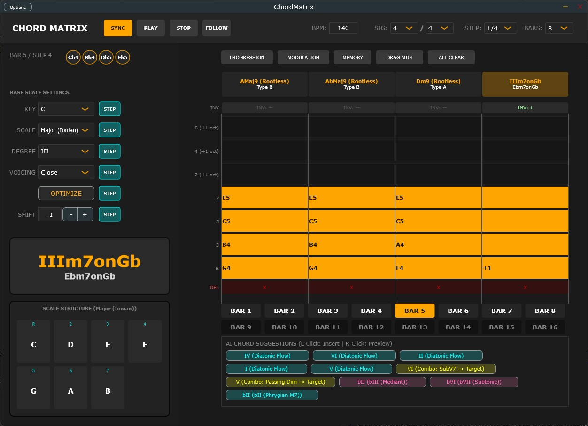

# ChordMatrix

##

## Overview

**ChordMatrix** is an advanced, algorithmic MIDI chord sequencer plugin (VST3/AU). Driven by a highly optimized, real-time safe C++ architecture and built upon advanced Music Set Theory, it is designed to intelligently generate complex, professional chord progressions and voice leadings across **90 distinct presets** and **55 musical scales**.

Engineered for modern music production workflows, ChordMatrix conceptualizes harmonic progressions not as static vertical blocks, but as a continuous, dynamic topological space. By modeling professional keyboard performance using a global **Viterbi Algorithm**, it automates complex voice leading, avoids avoid-notes, and creates smooth modulation lines, making it the ultimate tool for elite producers, film composers, and sound designers.

👉 **[Watch the Demo Video on X (動作デモ動画はこちら！)](https://x.com/kijyoumusic/status/2043315637070823725?s=20)**

## Key Features

### 🤖 Global Voice Leading Optimization (Viterbi Algorithm)

No more awkward harmonic leaps. Our engine treats the entire phrase as a multi-stage trellis diagram and calculates the absolute global minimum-cost trajectory across the entire timeline via the Viterbi algorithm. Click the **OPTIMIZE** button to cycle through 5 distinct musical interpretations (Personas) based on dynamic cost function weights:

* **Persona 0 (Best Balance):** Absolute mathematical global optimum for the smoothest fingerings.
* **Persona 1 (Melody Lead):** Prioritizes a beautiful, singing uppermost voice to draw melodic curves.
* **Persona 2 (Bass Lead):** Focuses on counter-point stability and sturdy motion in the low end.
* **Persona 3 (Compact Cluster):** Pulls all internal voices inward to form tight, modern jazz cluster structures.
* **Persona 4 (Alternate Ending):** Selects the second-best path to explore unique harmonic resolutions.

### 🌉 Context-Aware Modulation & Pivot Engine

Switching keys has never been more musical. Simply specify your target key, and the AI dynamically analyzes your preceding progression to generate a seamless "harmonic bridge" utilizing professional modulation pathways:

* **Pivot (Common Chord):** Mathematically finds a shared diatonic or modal chord to anchor the transition.
* **Tritone Substitution (SubV7):** Utilizes pitch-class symmetry to insert a polished jazz substitute cadence.
* **Passing Diminished (vii°7):** Constructs an ascending chromatic bass line that glides naturally into the new key.
* **Neo-Riemannian Transforms (P, L, R):** Algebraic music theory matrices that flip harmonic qualities (Major $\leftrightarrow$ Minor) while retaining maximum common tones.

### 🧠 Target-Aware AI Suggestions & Combos

The predictive suggest engine doesn't just guess the next single chord. It looks ahead to your future target harmonies and suggests **Target-Aware Combo Pathways**—such as multi-chord minor two-fives ($\text{ii}^\circ - \text{V7}\flat9$) or modal interchange sequences—calculated to resolve perfectly into your next intended harmony.

### 🧬 Self-Evolving Tension Generation

During Viterbi state traversal, the engine forks the path into parallel altered realities. If a dominant chord is evaluated, it mathematically determines whether a flat 9th ($\flat9$) or flat 13th ($\flat13$) sits closer to the subsequent harmony, automatically choosing alterations that mirror the choices of master jazz pianists and effortlessly evading avoid-notes.

### ⚡ Extreme Real-Time Optimization & DAW Safety

Built by a Senior DSP Architect, the plugin strictly adheres to real-time safety rules to guarantee zero dropouts, especially in demanding hosts like Ableton Live:

* **Lock-Free State Swapping (Double Buffering):** UI-to-DSP data transfer is handled via atomic pointer swapping ($O(1)$ overhead). Absolutely zero heap-allocations (`new`/`malloc`) or heavy `memcpy` operations occur on the audio thread.
* **VBlank-Driven UI Synchronization:** The GUI is completely decoupled from the DSP thread and driven by JUCE 8's `VBlankAttachment`, synchronizing the sequencer playhead exactly with your monitor's refresh rate, slashing CPU/GPU overhead.
* **DAW Jitter & Hot-Reset Protection:** Built-in fail-safes dynamically detect asynchronous sample-rate changes and playhead jitter (notorious in Ableton Live), triggering safe internal resets to prevent NaN generation and catastrophic audio spikes.
* **Sandwich Lock Scope Control:** Localized parameter scopes (STEP, BAR, ALL) use a non-destructive temporary locking system, allowing you to optimize specific bars without mutating your carefully manual locked points.

## 🎼 Supported Scales (55 Types)

ChordMatrix includes a static DSP-safe database of 55 distinctly mapped scale types spanning various musical cultures and complex harmonic systems:

* **Diatonic / Church Modes (0-6):** `Major (Ionian)`, `Dorian`, `Phrygian`, `Lydian`, `Mixolydian`, `Natural Minor (Aeolian)`, and `Locrian` — The bedrock of Western popular music.
* **Melodic Minor Modes (7-13):** `Melodic Minor`, `Dorian b2`, `Lydian Augmented`, `Lydian Dominant`, `Mixolydian b6`, `Locrian Natural 2`, and `Altered (Super Locrian)` — Essential for advanced jazz and modern electronic tension.
* **Harmonic Minor Modes (14-20):** `Harmonic Minor`, `Locrian Natural 6`, `Ionian #5`, `Dorian #4`, `Phrygian Dominant`, `Lydian #2`, and `Ultra Locrian` — Provides exotic, dark, and neo-classical tension curves.
* **Harmonic Major Modes (21-27):** `Harmonic Major`, `Dorian b5`, `Phrygian b4`, `Lydian b3`, `Mixolydian b2`, `Lydian Augmented #2`, and `Locrian bb7` — Advanced hybrid modalities blending major brightness with minor shadows.
* **Symmetrical Scales (28-33):** `Whole Tone`, `Diminished (HW)`, `Diminished (WH)`, `Augmented`, `Chromatic`, and `Tritone Scale` — Mathematical structures that dissolve traditional tonality for high tension.
* **Bebop Scales (34-38):** `Bebop Major`, `Bebop Dominant`, `Bebop Dorian`, `Bebop Melodic Minor`, and `Bebop Harmonic Minor` — 8-note scales that supply smooth jazz chromatic passing notes.
* **Pentatonic / World (39-54):** `Yonanuki Major/Minor`, `Ryukyu`, `Miyakobushi`, `Ritsu`, `Iwato`, `Gong`, `Yo`, `Hungarian Minor`, `Double Harmonic Major`, `Neapolitan Major/Minor`, `Pelog`, `Hirajoshi`, `Kumoi`, and `Insen` — Traditional ethnic tone maps from Japan, Bali, and around the globe.

## System Requirements & Compatibility

* **OS:** Windows 10 / Windows 11 (64-bit) **[Windows Only]**
* **Format:** VST3
* **Tested Host:** Ableton Live 11 / 12

⚠️ **Compatibility Notice:** This plugin is compiled and heavily optimized exclusively for Windows (AVX2 required). It has been strictly verified to work in **Ableton Live**. Operation and stability on other DAWs (FL Studio, Bitwig, Studio One, Cubase, etc.) are currently **unverified and unsupported**. Use at your own risk outside of Ableton Live.

## Installation

1. Download the latest `ChordMatrix.vst3` from the [[Releases](https://github.com/OTODESK4193/ChordMatrix/releases/latest)] page.
2. Move it to your VST3 directory: `C:\Program Files\Common Files\VST3`
3. Rescan plugins in your DAW.

## 📚 User Guide

A comprehensive manual covering detailed technical specifications and operational guidelines is included with this repository.

[ -red?style=for-the-badge&logo=adobe-acrobat-reader) ](Source/Assets/ChordMatrix_UserManual_JP.pdf)

[ -red?style=for-the-badge&logo=adobe-acrobat-reader) ](Source/Assets/ChordMatrix_UserManual_EN.pdf)

## Disclaimer & Stability

This software is provided "as-is", without any warranty of any kind.
While extreme care has been taken to ensure real-time safety and prevent audio dropouts through lock-free architectures and Viterbi path validations, unexpected behavior may still occur depending on extreme layout randomization.

## License

This project is free and open-source. It is distributed under the **GPLv3 License** (inherited via the JUCE framework infrastructure). You are free to study, modify, and distribute the source code under the same terms.

## 🎓 Credits

**Developer**: @your-username (ChordMatrix Engineering Team)

**Music Production Background**: Jazz Theory, Computational Harmonics, DSP Engineering

**Framework**: JUCE 8.0.8

---

## 📞 Support

- **Social**: [@kijyoumusic](https://twitter.com/kijyoumusic)
---
---

